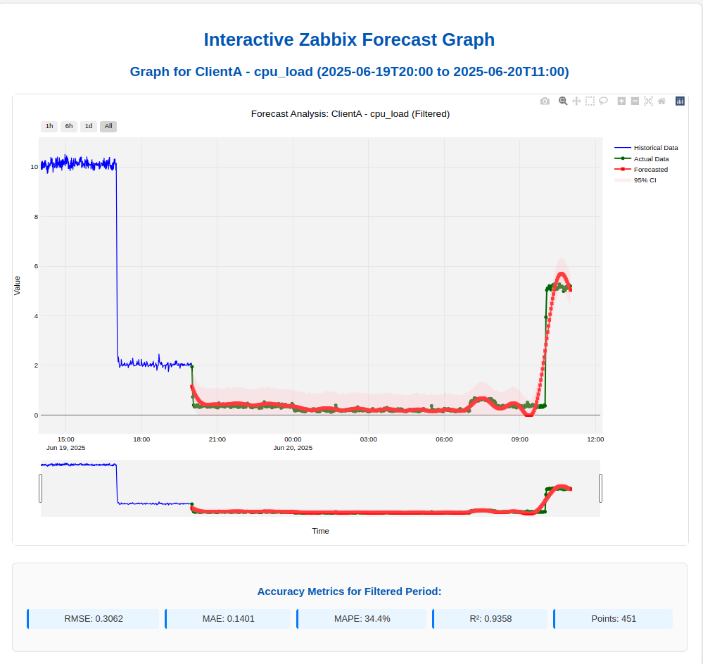

# 📈 Zabbix Metric Forecasting & Accuracy Analysis System: Proactive IT Operations with Machine Learning

## Empowering Predictive Capacity Planning and Performance Trend Analysis

[](https://www.python.org/)
[](https://flask.palletsprojects.com/)
[](https://www.docker.com/)
[](https://www.zabbix.com/)
[](https://facebook.github.io/prophet/)

---

## 💡 Project Overview: Solving Reactive Bottlenecks with AIOps

In dynamic infrastructure environments, reacting to performance issues after they occur leads to costly downtime and inefficient resource allocation. This project addresses that challenge head-on by building an intelligent, automated system for **predicting future resource demands** (specifically CPU load) and continuously validating those predictions.

The **Zabbix Metric Forecasting & Accuracy Analysis System** transforms raw monitoring data into actionable foresight, enabling IT teams to:

* **Prevent Performance Bottlenecks:** Anticipate CPU spikes *before* they impact services.
* **Optimize Resource Utilization:** Avoid over-provisioning (wasted costs) or under-provisioning (performance degradation).
* **Facilitate Proactive Capacity Planning:** Make data-driven decisions on infrastructure scaling.
* **Gain Actionable Trend Insights:** Understand long-term system behavior and growth.

## 📊 Visual Showcase: Predictive Power in Action

Witness the precision of our forecasting model! This graph illustrates how our **Facebook Prophet-based model** accurately predicts dynamic CPU load patterns across a 24-hour horizon, seamlessly tracking and anticipating changes.


*Figure 1: Comparison of Historical Data, Actual CPU Load, and Prophet Forecasts with 95% Confidence Interval.*

**Key Performance Indicators (KPIs) for the displayed period underscore the model's effectiveness:**
* **RMSE (Root Mean Squared Error):** `0.3062` (Indicating very low average prediction error)
* **MAE (Mean Absolute Error):** `0.1401` (Confirming minimal absolute deviation from actuals)
* **MAPE (Mean Absolute Percentage Error):** `34.4%` (Reflecting good accuracy, especially for data ranging near zero)
* **R² (Coefficient of Determination):** `0.9358` (Demonstrating that the model explains over **93% of the variance** in CPU load!)

## 🚀 Core Features & Technical Highlights

This system is an end-to-end, full-stack solution built with robustness and scalability in mind:

* **Dynamic Load Simulation:** A custom `generate_cpu_load.sh` script simulates realistic, predictable CPU load patterns on a client VM, providing a controlled environment for testing and data generation.
* **Robust Data Ingestion:** Seamless integration with **Zabbix Agents and Server** for real-time collection and storage of critical metric data (`system.cpu.load[all,avg1]`).
* **Intelligent Forecasting Service:**
    * A **Python Flask** web application, deployed with **Gunicorn** and **Gevent** workers for high performance and concurrency.
    * Connects to Zabbix API using a custom `ZabbixConnector`.
    * Incorporates comprehensive data preprocessing: NaN handling, downsampling to 2-minute intervals, and robust outlier clipping (winsorization).
    * Leverages **Facebook Prophet** for sophisticated time series modeling, chosen for its scalability and ability to handle multiple seasonalities.
* **Automated Accuracy Analysis:** A dedicated Python script (`accuracy_checker.py`) runs periodically to:
    * Align forecasted data with actual Zabbix metrics.
    * Calculate industry-standard accuracy metrics (RMSE, MAE, MAPE, R²).
    * Generate visual comparison plots and detailed JSON reports for continuous validation.
* **Interactive Web GUI:** A user-friendly Flask interface with dynamic, scrollable **Plotly.js** graphs for intuitive visualization of forecast vs. actual data, complete with zoom, pan, hover, and real-time metric display.
* **Containerized Deployment:** The entire application is **Dockerized** using `Dockerfile` and `docker-compose.yml`, ensuring consistent, isolated, and portable environments across development and production VMs.

## 🏗️ Architecture & Data Flow

The system operates as a continuous data pipeline, transforming raw monitoring data into predictive insights:

1.  **Load Generation (ClientA VM):** `generate_cpu_load.sh` creates dynamic CPU load.
2.  **Data Collection (ClientA -> Zabbix Server):** Zabbix Agent collects `system.cpu.load[all,avg1]` and sends it to the Zabbix Server's database.
3.  **Historical Data Store (Zabbix DB):** The "ground truth" for actual performance.
4.  **Forecasting Service (`app` container):**
    * **Data Fetch:** Retrieves latest 48 hours of historical data from Zabbix API.
    * **Preprocessing:** Cleans, downsamples (to 2-min), and normalizes data.
    * **Model Training:** Trains/retrains the **Prophet model**.
    * **Prediction:** Generates multi-step forecasts and confidence intervals.
    * **Persistence:** Stores predictions in `predictions_log.csv` and generates static plots.
5.  **Accuracy Analysis (`accuracy_checker` container):**
    * **Validation:** Periodically fetches corresponding actuals from Zabbix.
    * **Comparison:** Aligns data, calculates accuracy metrics (RMSE, MAE, MAPE, R²).
    * **Reporting:** Saves comparison plots and JSON reports.
6.  **Interactive GUI (Web Browser):** Users interact with `app` service to trigger forecasts and visualize results via Plotly.js.

## ⚙️ Setup & Local Installation

This project is designed for robust deployment using Docker Compose.

### Prerequisites

* **Zabbix Server:** A running instance with PostgreSQL/MySQL.
* **Zabbix Client VM (e.g., `ClientA`):** With Zabbix Agent installed and configured to monitor `system.cpu.load[all,avg1]`. Ensure `stress` utility is installed (`sudo apt-get install stress`).
* **Deployment Machine (Your VM/Server):** Docker and Docker Compose installed.

### Getting Started

1.  **Clone the Repository:**
    ```bash
    git clone [https://github.com/Aryan-0211/zabbix-forecasting-system.git](https://github.com/Aryan-0211/zabbix-forecasting-system.git)
    cd zabbix-forecasting-system
    ```

2.  **Configure `.env` File (CRITICAL: Private & Secure):**
    * Create a `.env` file in the project root (`~/zabbix_prototype/.env`):
        ```bash
        touch .env
        ```
    * Edit `.env` and add your Zabbix API credentials and Flask debug setting.
        **IMPORTANT: This file is in `.gitignore` and must NEVER be committed to Git.**
        ```dotenv
        ZABBIX_API_URL=http://<YOUR_ZABBIX_SERVER_IP_OR_HOSTNAME>/zabbix/api_jsonrpc.php
        ZABBIX_API_TOKEN=<YOUR_ZABBIX_API_TOKEN> # GET A NEW TOKEN AFTER INITIAL GIT PUSH!
        FORECASTING_MODEL_TYPE=PROPHET # Or ARIMA_ES (for Exponential Smoothing fallback)
        FLASK_DEBUG=False
        ```

3.  **Ensure Local Directories/Files Exist for Volume Mounts:**
    * Create these essential directories and empty files in your project root to ensure Docker bind mounts work correctly with appropriate permissions:
        ```bash
        mkdir -p models static/accuracy_plots comparison_results/json_reports configs src/models src/utils templates
        touch predictions_log.csv cpu_load_log.csv comparison_results/processed_batches.txt
        ```

4.  **Set Host UID/GID for Docker Permissions:**
    * Find your current user's UID and GID on your host machine:
        ```bash
        id -u # This is your HOST_UID
        id -g # This is your HOST_GID
        ```
    * **Update `HOST_UID` and `HOST_GID`** build arguments in your `docker-compose.yaml` (under both `app` and `accuracy_checker` services) and in the `Dockerfile`'s `ARG` instructions to match these values. This is vital for correct file permissions within mounted volumes.

5.  **Build and Run Docker Containers:**
    ```bash
    docker build -t zabbix-forecaster .
    docker compose up -d
    ```

6.  **Verify Container Status:**
    ```bash
    docker ps # Confirm 'zabbix_forecaster_app' and 'zabbix_accuracy_checker' are 'Up'
    docker compose logs -f # Check startup logs for both services (look for Gunicorn starting)
    ```

## 🎮 Usage

1.  **Start Load Generation (on ClientA VM):**
    * Execute the load generation script persistently:
        ```bash
        # On ClientA VM
        nohup bash generate_cpu_load.sh > generate_cpu_load.log 2>&1 &
        # Use 'top' or 'htop' to verify stress processes are running.
        ```
    * Allow adequate time (e.g., several hours) for Zabbix to collect a sufficient amount of dynamic load data before attempting forecasts.

2.  **Access the Forecasting GUI:**
    * Open your web browser and navigate to: `http://<YOUR_HOST_VM_IP>:5050` (Replace with your Docker host VM's IP address).

3.  **Generate & View Forecasts:**
    * Use the interactive GUI to select your host (`ClientA`), metric (`cpu_load`), and desired time range.
    * Alternatively, trigger a forecast directly via the API for testing (e.g., a 24-hour forecast at 2-minute intervals):
        `http://<YOUR_HOST_VM_IP>:5050/forecast/ClientA/cpu_load/720`
    * The GUI will display interactive plots and live accuracy metrics.

## 🔍 Challenges Overcome & Key Learnings

This project served as an invaluable deep dive into practical time series forecasting in a real-world monitoring context. Significant challenges provided critical learning opportunities:

* **Model Selection & Resource Optimization:** Initial attempts with `pmdarima.auto_arima` (for SARIMA models) proved prohibitively resource-intensive on our VM environment, leading to system hangs. This necessitated a strategic pivot to **Facebook Prophet**, which is optimized for scalability and performance.
* **Navigating Data Transformation Pitfalls:** A key debugging challenge emerged when Prophet initially produced "flat" (zero-value) forecasts. Through methodical log analysis and iterative testing, we identified that an interaction with the Box-Cox transformation (producing negative values that were then clamped) was the root cause. This led to the crucial decision of **removing Box-Cox for Prophet**.
* **Prophet Tuning for Step-like Patterns:** Standard Prophet seasonality often models smooth cycles. Our simulated CPU load, however, featured sharp, step-like transitions. This required precise tuning, including:
    * Implementing a **custom `daily_seasonality` with a high `fourier_order` (20)** to allow Prophet to capture these abrupt changes more accurately.
    * Leveraging **explicit `y_lower=0.0` and `y_upper=[Your_Max_Load]`** bounds to guide Prophet towards realistic, non-negative predictions within the system's capacity.
* **Robust Docker Volume Management:** Ensuring correct file permissions and persistence for generated logs, models, and plots within Docker containers, especially when dealing with `overlay2` and `snap` environments, required careful configuration of UID/GID and bind mounts.

## ✨ Future Enhancements

* Implementing a dedicated, scheduled model retraining pipeline (e.g., daily cron job) to ensure forecasts always use the freshest data.
* Expanding forecasting capabilities to include other critical Zabbix metrics (memory utilization, disk I/O, network traffic).
* Developing anomaly detection features to flag unexpected deviations from predicted norms.
* Integrating external factors (e.g., deployment schedules, holidays) as regressors in Prophet for even higher accuracy.
* Implementing a model comparison dashboard within the GUI to visually assess the performance of different forecasting algorithms.

## 📄 License

This project is licensed under the [MIT License](LICENSE).

## ✉️ Contact

For any questions, collaboration opportunities, or to discuss this project further, please feel free to connect with me:

* **LinkedIn:** https://www.linkedin.com/in/aryan-gadhavi-028592283/
* **Email:** aryangadhavi79@gmail.com
    ```
